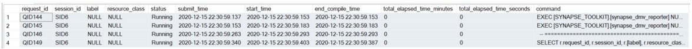
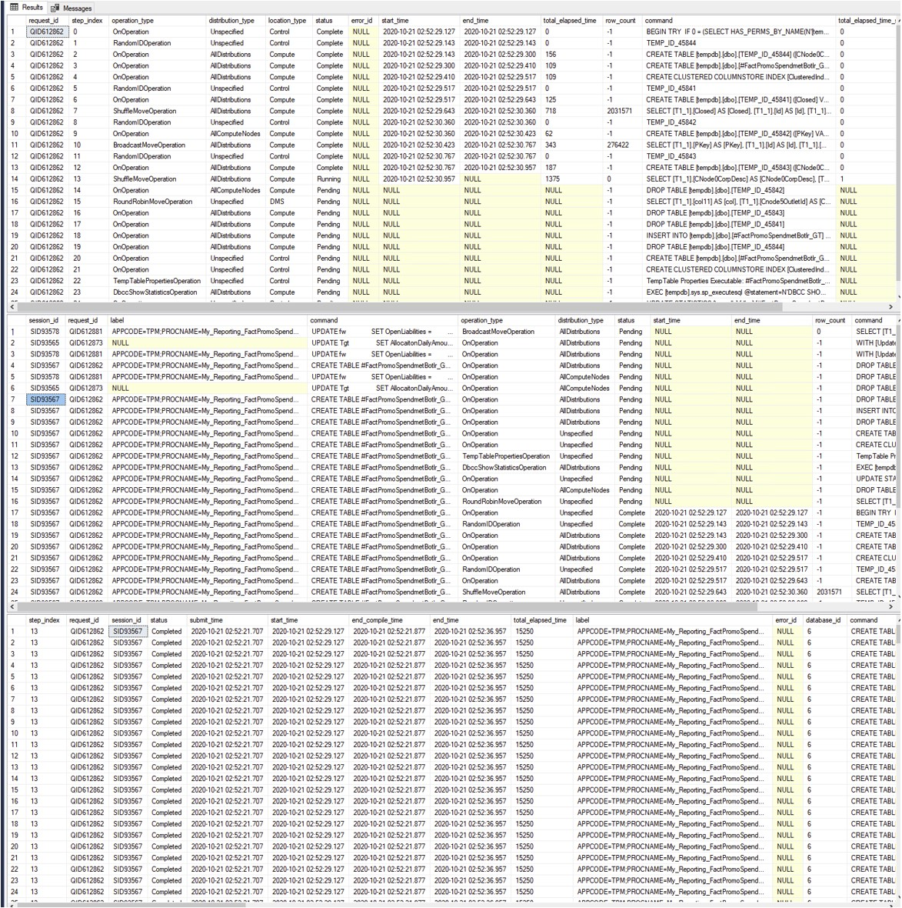

# Quering Synapse Dedicated Pool DMV with Synapse DMV Reporter
If you find yourself needing to frequently look into the dynamic management views of Dedicated SQL Pool to obtain details on how a specific query was being executed internally, this tool may be useful. It is a compilation of a solid set of frequently used DMV queries, packed into a single stored procedure.

It is recommended to read the following documentation before using _synapse_dmv_reporter_:
[Monitor your dedicated SQL pool workload using DMVs - Azure Synapse Analytics | Microsoft Docs](https://docs.microsoft.com/en-us/azure/synapse-analytics/sql-data-warehouse/sql-data-warehouse-manage-monitor)

In order to use the tool we need to create a schema named SYNAPSE_TOOLKIT: `CREATE SCHEMA SYNAPSE_TOOLKIT`

### The generic syntax to use it is:

`EXEC [SYNAPSE_TOOLKIT].[synapse_dmv_reporter] NULL, NULL`

In this case the stored procedure just lists what is running without giving any further details. It is perhaps useful in the case where we may to be so sure about what we are trying to get details about. Note that the [label] and the [request_id] columns are returned for all running queries.

## Using _synapse_dmv_reporter_ with a query label
During this migration, most queries inside Synapse Dedicated SQL Pool where labeled following a specific naming convention. Thanks to this effort, this label can be used to look into the query execution internals of the database engine, among other things. Synapse_dmv_reporter has an option to return details on queries that are running that have a specific label. The syntax to use it with a query label is:

`EXEC [SYNAPSE_TOOLKIT].[synapse_dmv_reporter] 'query label', NULL`

For example, the following syntax would return something similar the output below:

`EXEC [SYNAPSE_TOOLKIT].[synapse_dmv_reporter] 'My_Reporting_FactPromoSpendMetricBottler', NULL`

## Using _synapse_dmv_reporter_ with a request id
The second option is to look into a running query by its request id in the form of QID####. This is the option to use when we already know the QID#### of the query we are working with, which we can obtain by running the generic syntax explained above in this document.

`EXEC [SYNAPSE_TOOLKIT].[synapse_dmv_reporter] NULL, 'QID1234'`

 The result set with this second option will be similar to the result set of the first option by query label.
